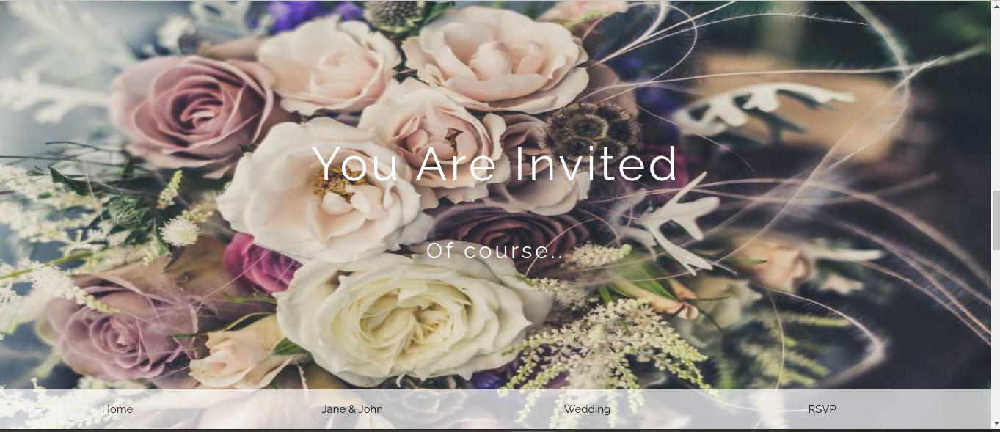

# wedding-template project
Wedding invitations nowadays can be done using simple sites showing clean images of the couple getting married, their wed location and invitation. This is what have been done in this investigation.
## App

### Built with
- HTML
- CSS
### Prerequisistes
knowlegde about:
- HTML
- CSS
- Google chrome
### Clone project
- Get a local copy of the project by following these steps.
- Clone the repository with `git@github.com:Nathanael-Lontsi/wedding-template.git` using your terminal.
## Steps
- $ `git@github.com:Nathanael-Lontsi/wedding-template.git`
- $ `cd wedding-template`
- $ `git checkout feature/rsvp`
## Start App
- run by opening the index.html in the browser
## Author
:bust_in_silhouette: **Nathanael-Lontsi**
-GitHub: [@Nathanael-Lontsi](https://github.com/Nathanael-Lontsi/wedding-template)
## :hanshake: contributing
Contributions, issues, and feature requests are welcome!
Feel free to check the [issues page](https://github.com/Nathanael-Lontsi/wedding-template/issues).
## :memo: license
This project is [w3school](./LICENSE) licensed.